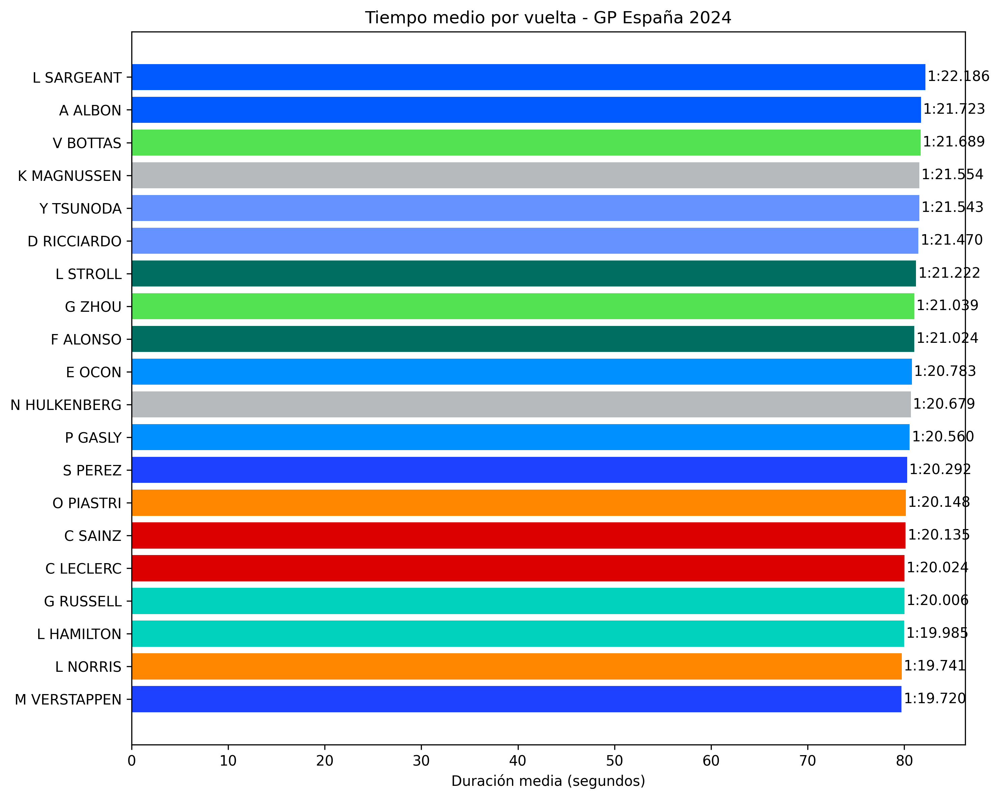

# 🏎️ F1 Analysis with OpenF1 API

Este proyecto utiliza datos de la API pública [OpenF1](https://openf1.org) para analizar y visualizar el rendimiento de los pilotos en el Gran Premio de España 2024.

Actualmente, el proyecto está en una fase inicial de análisis exploratorio y visualización de datos, con la intención de evolucionar hacia un pipeline completo de ingeniería de datos.

---

## 🚀 Objetivos del proyecto

- Obtener y procesar datos históricos de Fórmula 1 mediante la API de OpenF1.
- Analizar el rendimiento de los pilotos vuelta a vuelta.
- Visualizar comparativas de tiempos medios por piloto y equipo.
- Preparar el entorno para una futura evolución hacia procesamiento con Docker, PySpark y arquitectura moderna.

---

## 📦 Estructura actual
```
├── ingest_laps.py             # Descarga los datos de vueltas desde la API
├── explore_laps.py            # Inspección inicial del CSV
├── mean_time.py               # Análisis y visualización de tiempos medios por piloto
├── drivers.py                 # Añade el nombre del piloto y su equipo
├── laps_spain_2024.csv        # Archivo original descargado
├── laps_spain_2024_named.csv  # Versión enriquecida con nombres y equipos
└── README.md                  
```

---

## 📊 Visualización

El script `mean_time.py` genera un gráfico de barras horizontal con:
- Tiempos medios por vuelta de cada piloto (excluyendo pit-out laps)
- Colores según el equipo
- Etiquetas con formato `min:seg.milisegundos` (ej. `1:17.456`)

## 📊 Ejemplo de visualización




---

## ⚙️ Requisitos

- Python 3.8+
- Librerías:

```bash
pip install pandas matplotlib requests
```
## 🔮 Próximos pasos

- Añadir análisis comparativo entre compañeros de equipo  
- Exportar resultados a formato Parquet  
- Contenerizar el proyecto con Docker  
- Procesamiento escalable con PySpark  
- Orquestación con Airflow o Prefect  
- Almacenamiento y visualización en la nube  
